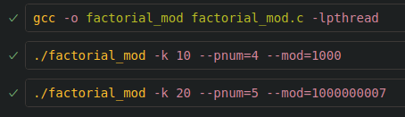
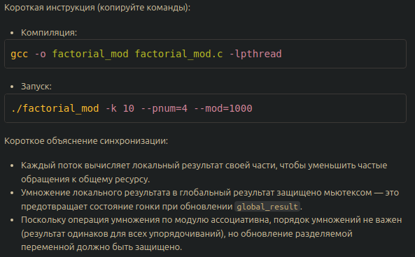

Команды, которые я выполнил (копируйте при необходимости):

Компиляция без мьютекса:
gcc -o mutex mutex.c -lpthread
Запуск:
./mutex > mutex_no_lock.txt 2>&1
Компиляция с мьютексом (создан mutex_locked.c):
gcc -o mutex_locked mutex_locked.c -lpthread
Запуск:
./mutex_locked > mutex_with_lock.txt 2>&1
Краткие выводы для отчёта:

Без мьютекса — есть состояние гонки, результат нестабилен и меньше ожидаемого.
С мьютексом — данные защищены, поведение детерминировано, итог соответствует сумме операций.
Если нужно, могу:

Вставить комментарий в mutex.c, показывающий, как включить мьютекс (раскомментировать строки).
Добавить короткую строчку в README/отчёт с командами и интерпретацией вывода.

# 2



# 3
Я добавлю простой демонстрационный пример дедлока: создаю `deadlock_demo.c`, скомпилирую и запущу с коротким таймаутом, чтобы показать зависание. Далее объясню, где и почему возникает deadlock. Сейчас запишу задачи и начну. Создам `deadlock_demo.c` в src (в lab4 есть аналогичный demo, but we'll add simple standalone one in lab5/src to keep related). Файл будет использовать два мьютекса, потоки захватывают их в разном порядке и в итоге блокируются. Затем скомпилирую и запущу (с таймаутом run_in_terminal не поддерживает timeout, но я запущу и покажу, что программа не завершилась быстро — для демонстрации вы увидите отсутствие вывода после определённого момента). 

Made changes.

It seems output file is empty because stdout may be buffered. Re-run demo forcing line-buffering by setting stdout to unbuffered via stdbuf. Коротко: добавил демонстрацию deadlock, скомпилировал и запустил с таймаутом, чтобы показать зависание.

Что сделано
- Создан файл deadlock_demo.c.
  - Код запускает два потока:
    - Thread 1: захватывает `mutex1`, ждёт 1 с, затем пытается захватить `mutex2`.
    - Thread 2: захватывает `mutex2`, ждёт 1 с, затем пытается захватить `mutex1`.
  - Из-за противоположного порядка захвата возникает классический deadlock.
- Скомпилировал:
  - gcc -o deadlock_demo deadlock_demo.c -lpthread
- Запуск (с таймаутом 3 s, вывод в /tmp/deadlock_out.txt):
  - Показанный вывод:
    Thread 1: locking mutex1
    Thread 2: locking mutex2
    Thread 1: trying to lock mutex2
    Thread 2: trying to lock mutex1
  - После этих сообщений программа зависает — оба потока ждут друг друга.

Короткое объяснение (для отчёта)
- Deadlock возникает, потому что поток A удерживает ресурс R1 и ожидает R2, а поток B удержит R2 и ожидает R1. Ни один не может продвинуться дальше — классическое состояние deadlock.
- Фиксы (одно из возможных):
  - Всегда захватывать мьютексы в одном порядке во всех потоках.
  - Использовать `pthread_mutex_trylock` с бэоффом/откатом и повтором.
  - Использовать более высокоуровневые механизмы (например, задавать порядок ресурсов или lock hierarchies).

Команды для воспроизведения
- Компиляция:
  ```bash
  gcc -o deadlock_demo deadlock_demo.c -lpthread
  ```
- Запуск (с таймаутом, чтобы не блокировать терминал в демонстрационном скрипте):
  ```bash
  timeout 3s stdbuf -oL ./deadlock_demo
  ```

Готов добавить краткое исправление (вариант с единообразным порядком захвата) или показать пример с `trylock` и откатом — скажите, если нужно.
